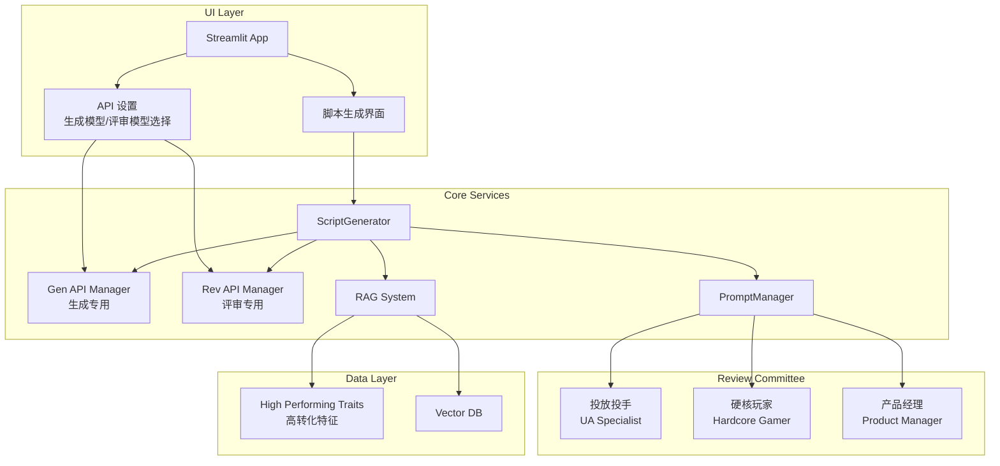

# Design Document

## Overview

本设计文档描述了 CreativElixir 项目评审模块的重构方案。核心改造包括：
1. **架构层** - ScriptGenerator 支持双 API 管理器（生成/评审分离）
2. **数据层** - RAGSystem 新增高转化特征检索方法
3. **提示词层** - 新增多角色委员会评审模板
4. **逻辑层** - 评审流程整合 RAG 标准和专用评审 API
5. **UI 层** - 侧边栏增加评审模型选择

## Architecture



## Components and Interfaces

### 1. ScriptGenerator 改造 (`src/script_generator.py`)

支持双 API 管理器的脚本生成器。

```python
class ScriptGenerator:
    def __init__(
        self,
        api_manager: APIManager,
        rag_system: RAGSystem,
        review_api_manager: Optional[APIManager] = None
    ):
        """
        初始化脚本生成器
        
        Args:
            api_manager: 生成专用 API 管理器
            rag_system: RAG 系统实例
            review_api_manager: 评审专用 API 管理器（可选，默认使用 api_manager）
        """
        self.gen_api = api_manager
        self.rev_api = review_api_manager if review_api_manager else api_manager
        self.rag_system = rag_system
    
    def _review_script(self, input_data: GenerationInput, script: str) -> str:
        """
        使用高级评审流程评审脚本
        
        步骤:
        1. 获取 RAG 高转化特征
        2. 构建高级评审 Prompt
        3. 使用评审专用 API 发送请求
        """
        pass
    
    def get_model_info(self) -> dict:
        """获取当前使用的模型信息"""
        pass
```

### 2. RAGSystem 扩展 (`src/rag_system.py`)

新增高转化特征检索方法。

```python
class RAGSystem:
    # 高转化特征硬编码（MVP 阶段）
    HIGH_PERFORMING_TRAITS = {
        "SLG": """1. 前3秒必须展示战力数值跳动或地图扩张。
2. 必须包含'以弱胜强'的策略反转。
3. 结尾强调'开局送连抽'。""",
        
        "MMO": """1. 必须展示高精度捏脸或装备发光特效。
2. 强调'自由交易'或'回收'利益点。
3. 拒绝长旁白，多用战斗实录。""",
        
        "DEFAULT": """1. 黄金前3秒吸睛。
2. 卖点清晰。
3. 强力 CTA 引导转化。"""
    }
    
    def get_high_performing_traits(self, category: str) -> str:
        """
        获取指定品类的高转化广告特征
        
        Args:
            category: 游戏品类（SLG、MMO、休闲等）
            
        Returns:
            高转化特征描述字符串
        """
        pass
```

### 3. PromptManager 扩展 (`src/prompts.py`)

新增高级评审模板。

```python
ADVANCED_REVIEW_TEMPLATE = """你不仅是创意总监，更是由三位资深专家组成的【游戏广告评审委员会】主席。
你需要综合各方视角，利用【市场高转化标准】对待评审脚本进行"攻击性"评审。

## 1. 输入信息
- **游戏介绍：** {game_intro}
- **独特卖点 (USP)：** {usp}
- **目标人群：** {target_audience}
- **游戏品类：** {category}

## 2. 核心依据：市场高转化标准 (RAG Retrieved)
⚠️ **这是评审的最高法律**。根据数据库中同品类的高转化广告分析，爆款脚本通常具备以下特征，请严格核对脚本是否符合：
{rag_traits}

## 3. 待评审脚本
{script}

## 4. 委员会分角评审
请依次模拟以下三位专家的口吻和视角进行评审：

### 🕵️ 角色 A：资深投放投手 (User Acquisition Specialist)
* **关注点**：黄金前3秒吸睛度、无效镜头、CTA (Call to Action) 诱惑力。
* **判词**：(指出浪费预算的镜头)

### 🎮 角色 B：硬核游戏玩家 (Hardcore Gamer)
* **关注点**：真实性（拒绝CG诈骗）、术语准确性、爽点还原度。
* **判词**：(指出让玩家尴尬出戏的台词)

### 💼 角色 C：产品经理 (Product Manager)
* **关注点**：USP ({usp}) 传达清晰度、人群匹配度。
* **判词**：(评估卖点是否被剧情淹没)

## 5. 主席总结与修改指令
汇总专家意见，给出 **3 条最高优先级的修改建议**。
格式要求：
1. **[问题位置]** (如：分镜2-口播)
   - **问题诊断**：...
   - **修改方案**：(给出具体的修改后文案/画面)
"""

class PromptManager:
    DEFAULT_PROMPTS = {
        "draft": DRAFT_PROMPT,
        "review": REVIEW_PROMPT,
        "refine": REFINE_PROMPT,
        "quick": QUICK_GENERATION_PROMPT,
        "advanced_review": ADVANCED_REVIEW_PROMPT,  # 新增
    }
    
    @classmethod
    def get_review_prompt(
        cls,
        game_intro: str,
        usp: str,
        target_audience: str,
        category: str,
        script: str,
        rag_traits: Optional[str] = None,  # 新增参数
        use_advanced: bool = True  # 是否使用高级评审模板
    ) -> str:
        """获取脚本评审 Prompt"""
        pass
```

### 4. UI 改造 (`app.py`)

侧边栏增加评审模型选择。

```python
def render_api_settings():
    """渲染 API 设置区域"""
    # ... 现有代码 ...
    
    # 新增：评审模型选择
    st.markdown("#### 评审模型设置")
    all_configs = api_manager.get_all_configs()
    config_names = [config.name for config in all_configs]
    
    # 默认选项：使用生成模型
    review_options = ["使用生成模型"] + config_names
    
    selected_review_model = st.selectbox(
        "选择评审模型",
        review_options,
        help="选择用于脚本评审的模型，可以与生成模型不同以获得多元视角"
    )
    
    # 保存到 session_state
    if selected_review_model == "使用生成模型":
        st.session_state.review_api_manager = None
    else:
        # 创建评审专用的 API 管理器
        st.session_state.review_api_manager = create_api_manager_for_config(selected_review_model)

def render_script_generation():
    """渲染脚本生成界面"""
    # 显示当前模型配置
    gen_config = st.session_state.api_manager.load_config()
    rev_manager = st.session_state.get("review_api_manager")
    
    if gen_config:
        model_info = f"生成模型: {gen_config.model_id}"
        if rev_manager:
            rev_config = rev_manager.load_config()
            model_info += f" | 评审模型: {rev_config.model_id}"
        else:
            model_info += " | 评审模型: 同上"
        st.caption(model_info)
    
    # 初始化 ScriptGenerator 时传入评审 API 管理器
    generator = ScriptGenerator(
        api_manager=st.session_state.api_manager,
        rag_system=st.session_state.rag_system,
        review_api_manager=st.session_state.get("review_api_manager")
    )
```

## Data Models

### 高转化特征数据结构

```python
# MVP 阶段使用硬编码，未来可扩展为数据库存储
HIGH_PERFORMING_TRAITS = {
    "SLG": {
        "traits": [
            "前3秒必须展示战力数值跳动或地图扩张",
            "必须包含'以弱胜强'的策略反转",
            "结尾强调'开局送连抽'"
        ],
        "source": "hardcoded",  # 未来可改为 "rag_retrieved"
        "updated_at": "2024-01-01"
    },
    "MMO": {
        "traits": [
            "必须展示高精度捏脸或装备发光特效",
            "强调'自由交易'或'回收'利益点",
            "拒绝长旁白，多用战斗实录"
        ],
        "source": "hardcoded",
        "updated_at": "2024-01-01"
    }
}
```

### Session State 扩展

```python
# app.py session_state 新增字段
st.session_state.review_api_manager = None  # 评审专用 API 管理器
st.session_state.selected_review_config = "使用生成模型"  # 选中的评审模型配置名
```


## Correctness Properties

*A property is a characteristic or behavior that should hold true across all valid executions of a system-essentially, a formal statement about what the system should do. Properties serve as the bridge between human-readable specifications and machine-verifiable correctness guarantees.*

### Property 1: 双 API 管理器正确分离

*For any* ScriptGenerator 实例，当同时提供 gen_api_manager 和 review_api_manager 时，生成流程应使用 gen_api_manager，评审流程应使用 review_api_manager，两者互不干扰。

**Validates: Requirements 1.1, 1.3, 1.4**

### Property 2: 默认评审 API 回退

*For any* ScriptGenerator 实例，当 review_api_manager 未提供（为 None）时，rev_api 应等于 gen_api，确保向后兼容。

**Validates: Requirements 1.2**

### Property 3: RAG 特征检索完整性

*For any* 品类字符串输入，get_high_performing_traits 方法应返回非空字符串，且对于已知品类（SLG、MMO）返回特定特征，对于未知品类返回通用特征。

**Validates: Requirements 2.1, 2.4**

### Property 4: Prompt 模板 RAG 特征注入

*For any* rag_traits 字符串，调用 get_review_prompt 并传入该字符串后，返回的 prompt 应包含该 rag_traits 内容。

**Validates: Requirements 3.4**

### Property 5: 评审流程 RAG 集成

*For any* 评审请求，_review_script 方法应先调用 get_high_performing_traits 获取特征，然后将特征注入 prompt，最后使用 rev_api 发送请求。

**Validates: Requirements 4.1, 4.2, 4.3**

### Property 6: RAG 特征获取失败回退

*For any* 评审请求，当 get_high_performing_traits 抛出异常时，评审流程应使用默认通用特征继续执行，而非中断。

**Validates: Requirements 4.5**

## Error Handling

### 双模型架构错误处理

| 错误类型 | 处理方式 |
|---------|---------|
| review_api_manager 配置无效 | 回退使用 gen_api_manager，记录警告日志 |
| 评审 API 调用失败 | 返回错误信息，不影响已生成的脚本初稿 |
| 评审 API 超时 | 显示"评审超时，请稍后重试"，保留初稿结果 |

### RAG 特征检索错误处理

| 错误类型 | 处理方式 |
|---------|---------|
| 品类不存在 | 返回默认通用特征 |
| 特征数据损坏 | 返回默认通用特征，记录错误日志 |
| 未来向量库检索失败 | 回退到硬编码特征 |

### UI 错误处理

| 错误类型 | 处理方式 |
|---------|---------|
| 评审模型配置加载失败 | 显示警告，默认使用生成模型 |
| 模型切换失败 | 显示错误提示，保持当前配置 |

## Testing Strategy

### 单元测试

使用 pytest 进行单元测试，覆盖以下场景：

- `test_script_generator.py`:
  - 测试双 API 管理器初始化
  - 测试默认评审 API 回退
  - 测试评审流程使用正确的 API
  
- `test_rag_system.py`:
  - 测试 get_high_performing_traits 方法
  - 测试各品类特征返回
  - 测试未知品类默认特征
  
- `test_prompts.py`:
  - 测试 ADVANCED_REVIEW_TEMPLATE 存在性
  - 测试模板包含必要占位符
  - 测试 rag_traits 参数注入

### 属性测试

使用 pytest 进行属性测试，验证核心正确性属性：

```python
import pytest
from unittest.mock import Mock, patch

# Property 1: 双 API 管理器正确分离
def test_dual_api_manager_separation():
    """Feature: dual-model-review-architecture, Property 1: 双 API 管理器正确分离"""
    gen_api = Mock()
    rev_api = Mock()
    rag_system = Mock()
    
    generator = ScriptGenerator(
        api_manager=gen_api,
        rag_system=rag_system,
        review_api_manager=rev_api
    )
    
    assert generator.gen_api is gen_api
    assert generator.rev_api is rev_api
    assert generator.gen_api is not generator.rev_api

# Property 2: 默认评审 API 回退
def test_default_review_api_fallback():
    """Feature: dual-model-review-architecture, Property 2: 默认评审 API 回退"""
    gen_api = Mock()
    rag_system = Mock()
    
    generator = ScriptGenerator(
        api_manager=gen_api,
        rag_system=rag_system,
        review_api_manager=None
    )
    
    assert generator.rev_api is generator.gen_api

# Property 3: RAG 特征检索完整性
@pytest.mark.parametrize("category,expected_keywords", [
    ("SLG", ["战力", "以弱胜强", "连抽"]),
    ("MMO", ["捏脸", "自由交易", "回收"]),
    ("休闲", ["前3秒", "卖点", "CTA"]),
    ("未知品类", ["前3秒", "卖点", "CTA"]),
])
def test_high_performing_traits_completeness(category, expected_keywords):
    """Feature: dual-model-review-architecture, Property 3: RAG 特征检索完整性"""
    rag_system = RAGSystem()
    traits = rag_system.get_high_performing_traits(category)
    
    assert traits is not None
    assert len(traits) > 0
    for keyword in expected_keywords:
        assert keyword in traits

# Property 4: Prompt 模板 RAG 特征注入
def test_prompt_rag_traits_injection():
    """Feature: dual-model-review-architecture, Property 4: Prompt 模板 RAG 特征注入"""
    test_traits = "测试特征内容_12345"
    
    prompt = PromptManager.get_review_prompt(
        game_intro="测试游戏",
        usp="测试卖点",
        target_audience="测试人群",
        category="SLG",
        script="测试脚本",
        rag_traits=test_traits
    )
    
    assert test_traits in prompt
```

### 测试配置

- 单元测试使用 Mock 对象模拟 API 调用
- 属性测试验证核心逻辑正确性
- 集成测试验证 UI 和核心模块协作

