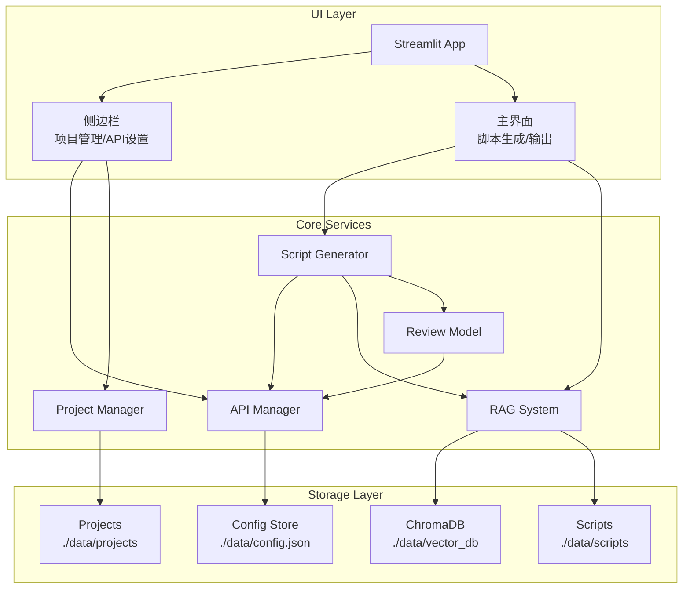

# Design Document

## Overview

游戏信息流广告脚本自动化工具采用 Python + Streamlit 技术栈构建，使用 LangChain 实现 RAG 逻辑，ChromaDB 作为向量存储。系统采用模块化架构，将 API 管理、知识库、项目管理和脚本生成工作流解耦，便于维护和扩展。

## Architecture



## Components and Interfaces

### 1. API Manager (`src/api_manager.py`)

负责 LLM API 的配置管理和调用。

```python
class APIConfig:
    api_key: str
    base_url: str
    model_id: str
    name: str  # 配置名称

class APIManager:
    def __init__(self, config_path: str = "./data/config.json"):
        """初始化 API 管理器"""
        pass
    
    def save_config(self, config: APIConfig) -> bool:
        """保存 API 配置到本地"""
        pass
    
    def load_config(self) -> APIConfig | None:
        """加载已保存的 API 配置"""
        pass
    
    def get_llm_client(self) -> OpenAI:
        """获取 OpenAI 兼容的 LLM 客户端"""
        pass
    
    def test_connection(self) -> tuple[bool, str]:
        """测试 API 连接是否有效"""
        pass
    
    def stream_chat(self, messages: list[dict], **kwargs) -> Generator[str, None, None]:
        """流式调用 LLM"""
        pass
```

### 2. RAG System (`src/rag_system.py`)

基于 LangChain 和 ChromaDB 的检索增强生成系统。

```python
class RAGSystem:
    def __init__(self, 
                 vector_db_path: str = "./data/vector_db",
                 scripts_path: str = "./data/scripts"):
        """初始化 RAG 系统"""
        pass
    
    def add_script(self, 
                   content: str, 
                   category: str,  # SLG, MMO, 休闲等
                   metadata: dict) -> str:
        """添加脚本到知识库，返回文档ID"""
        pass
    
    def search(self, 
               query: str, 
               category: str,
               top_k: int = 5) -> list[Document]:
        """检索同品类相关脚本"""
        pass
    
    def export_knowledge_base(self, output_path: str) -> str:
        """导出知识库为 zip 文件"""
        pass
    
    def import_knowledge_base(self, zip_path: str) -> bool:
        """导入知识库 zip 文件"""
        pass
    
    def get_categories(self) -> list[str]:
        """获取所有游戏品类"""
        pass
    
    def delete_script(self, doc_id: str) -> bool:
        """删除指定脚本"""
        pass
```

### 3. Project Manager (`src/project_manager.py`)

项目归档和管理模块。

```python
class Project:
    client_name: str
    project_name: str
    game_intro: str
    usp: str
    target_audience: str
    category: str
    created_at: datetime
    scripts_history: list[ScriptRecord]

class ScriptRecord:
    content: str
    created_at: datetime
    version: int
    is_archived: bool  # 是否已入库

class ProjectManager:
    def __init__(self, projects_path: str = "./data/projects"):
        """初始化项目管理器"""
        pass
    
    def create_project(self, client_name: str, project_name: str) -> Project:
        """创建新项目"""
        pass
    
    def get_project(self, client_name: str, project_name: str) -> Project | None:
        """获取项目"""
        pass
    
    def list_projects(self) -> list[Project]:
        """列出所有项目"""
        pass
    
    def list_clients(self) -> list[str]:
        """列出所有客户"""
        pass
    
    def update_project(self, project: Project) -> bool:
        """更新项目信息"""
        pass
    
    def add_script_to_history(self, 
                              client_name: str, 
                              project_name: str,
                              script: str) -> ScriptRecord:
        """添加脚本到项目历史"""
        pass
    
    def delete_project(self, client_name: str, project_name: str) -> bool:
        """删除项目"""
        pass
```

### 4. Script Generator (`src/script_generator.py`)

脚本生成工作流核心模块。

```python
class GenerationInput:
    game_intro: str
    usp: str
    target_audience: str
    category: str

class ScriptOutput:
    storyboard: list[str]  # 分镜
    voiceover: list[str]   # 口播
    design_intent: list[str]  # 设计意图

class GenerationStep:
    step_name: str  # rag_search, draft, review, refine
    status: str     # pending, running, completed, failed
    content: str
    timestamp: datetime

class ScriptGenerator:
    def __init__(self, 
                 api_manager: APIManager,
                 rag_system: RAGSystem):
        """初始化脚本生成器"""
        pass
    
    def generate(self, 
                 input_data: GenerationInput,
                 on_step: Callable[[GenerationStep], None] = None) -> Generator[str, None, ScriptOutput]:
        """
        执行完整生成工作流，支持流式输出
        流程: RAG检索 -> 生成初稿 -> 评审 -> 迭代修正
        """
        pass
    
    def _search_references(self, input_data: GenerationInput) -> list[Document]:
        """RAG 检索同品类爆款脚本"""
        pass
    
    def _generate_draft(self, 
                        input_data: GenerationInput,
                        references: list[Document]) -> Generator[str, None, str]:
        """生成脚本初稿"""
        pass
    
    def _review_script(self, script: str) -> str:
        """评审脚本并给出修改意见"""
        pass
    
    def _refine_script(self, 
                       script: str, 
                       review_feedback: str) -> Generator[str, None, str]:
        """根据评审意见迭代修正"""
        pass
    
    def _parse_output(self, raw_script: str) -> ScriptOutput:
        """解析脚本为标准三栏格式"""
        pass
```

### 5. Streamlit UI (`app.py`)

主应用入口和界面组织。

```python
# 页面配置
st.set_page_config(
    page_title="游戏广告脚本生成器",
    page_icon="🎮",
    layout="wide",
    initial_sidebar_state="expanded"
)

# 侧边栏结构
with st.sidebar:
    # Logo 和标题
    # API 设置 (expander)
    # 项目管理 (expander)
    # 知识库管理 (expander)

# 主界面结构
tabs = st.tabs(["📝 脚本生成", "📚 知识库", "📊 项目历史"])

with tabs[0]:  # 脚本生成
    # 输入区域: 游戏介绍、USP、目标人群、品类选择
    # 生成按钮
    # 流式输出区域
    # 结果展示: 三栏表格
    # 入库按钮

with tabs[1]:  # 知识库
    # 品类筛选
    # 脚本列表
    # 导入/导出按钮

with tabs[2]:  # 项目历史
    # 项目选择
    # 历史脚本列表
```

## Data Models

### Config Schema (`./data/config.json`)

```json
{
  "api_configs": [
    {
      "name": "default",
      "api_key": "sk-xxx",
      "base_url": "https://api.openai.com/v1",
      "model_id": "gpt-4"
    }
  ],
  "active_config": "default",
  "categories": ["SLG", "MMO", "休闲", "卡牌", "二次元", "模拟经营"]
}
```

### Project Schema (`./data/projects/{client}/{project}/project.json`)

```json
{
  "client_name": "客户A",
  "project_name": "游戏X推广",
  "game_intro": "这是一款...",
  "usp": "独特卖点...",
  "target_audience": "18-35岁男性玩家",
  "category": "SLG",
  "created_at": "2024-01-01T00:00:00",
  "updated_at": "2024-01-02T00:00:00"
}
```

### Script History Schema (`./data/projects/{client}/{project}/scripts/`)

```json
{
  "id": "uuid",
  "content": "脚本内容...",
  "parsed_output": {
    "storyboard": ["分镜1", "分镜2"],
    "voiceover": ["口播1", "口播2"],
    "design_intent": ["意图1", "意图2"]
  },
  "version": 1,
  "is_archived": false,
  "created_at": "2024-01-01T00:00:00"
}
```

### RAG Script Schema (`./data/scripts/{category}/`)

```json
{
  "id": "uuid",
  "content": "脚本内容...",
  "category": "SLG",
  "metadata": {
    "game_name": "游戏名",
    "performance": "爆款",
    "source": "user_archive",
    "archived_at": "2024-01-01T00:00:00"
  }
}
```

## Correctness Properties

*A property is a characteristic or behavior that should hold true across all valid executions of a system-essentially, a formal statement about what the system should do. Properties serve as the bridge between human-readable specifications and machine-verifiable correctness guarantees.*

### Property 1: API 配置 Round-Trip

*For any* valid API 配置（包含 api_key、base_url、model_id），保存到 Config_Store 后重新加载，应该得到与原始配置完全相同的数据。

**Validates: Requirements 1.2, 1.6**

### Property 2: 无效 API 配置错误处理

*For any* 无效的 API 配置（空字符串、格式错误的 URL 等），API_Manager 应该返回错误信息而不是抛出异常或崩溃。

**Validates: Requirements 1.5**

### Property 3: 知识库 Round-Trip

*For any* 知识库状态（包含多个品类的脚本数据），导出为 zip 文件后再导入，应该恢复到与导出前完全相同的状态，包括所有脚本内容和元数据。

**Validates: Requirements 2.3, 2.4**

### Property 4: 脚本品类分类存储

*For any* 脚本和指定的游戏品类，添加到知识库后，通过该品类检索应该能够找到该脚本，且脚本的品类元数据应该与指定品类一致。

**Validates: Requirements 2.2, 2.5**

### Property 5: 项目数据 Round-Trip

*For any* 项目数据（包含客户名、项目名、游戏介绍、USP、目标人群、历史脚本），保存后重新加载应该得到完全相同的数据，且不同项目的数据应该相互隔离。

**Validates: Requirements 3.1, 3.2, 3.3, 3.4, 3.5**

### Property 6: 脚本输出解析

*For any* 符合三栏格式的脚本文本，解析后应该得到包含分镜、口播、设计意图三个非空列表的 ScriptOutput 对象，且列表长度应该相等。

**Validates: Requirements 4.6**

### Property 7: 输入验证

*For any* 生成输入数据，如果游戏介绍、USP、目标人群任一字段为空或仅包含空白字符，Script_Generator 应该拒绝该输入并返回验证错误。

**Validates: Requirements 4.1**

## Error Handling

### API 错误处理

| 错误类型 | 处理方式 |
|---------|---------|
| API Key 无效 | 显示"API Key 无效，请检查配置"，不阻塞其他功能 |
| 连接超时 | 显示"连接超时，请检查网络或 Base URL"，支持重试 |
| 模型不存在 | 显示"模型 ID 不存在，请检查配置" |
| 速率限制 | 显示"请求过于频繁，请稍后重试"，自动延迟重试 |

### 知识库错误处理

| 错误类型 | 处理方式 |
|---------|---------|
| 向量库损坏 | 提示用户重新导入知识库或清空重建 |
| 导入文件格式错误 | 显示"文件格式不正确，请上传有效的知识库导出文件" |
| 磁盘空间不足 | 显示"磁盘空间不足，请清理后重试" |

### 项目管理错误处理

| 错误类型 | 处理方式 |
|---------|---------|
| 项目名重复 | 显示"项目已存在，请使用其他名称" |
| 项目文件损坏 | 尝试从备份恢复，失败则提示用户 |
| 客户名包含非法字符 | 自动过滤非法字符或提示用户修改 |

### 脚本生成错误处理

| 错误类型 | 处理方式 |
|---------|---------|
| RAG 检索失败 | 跳过检索步骤，使用空参考继续生成 |
| 生成中断 | 保存已生成的部分内容，支持断点续传 |
| 解析失败 | 显示原始输出，提供手动编辑选项 |

## Testing Strategy

### 单元测试

使用 pytest 进行单元测试，覆盖以下模块：

- `test_api_manager.py`: API 配置的保存、加载、验证
- `test_rag_system.py`: 脚本添加、检索、导入导出
- `test_project_manager.py`: 项目创建、更新、删除、历史管理
- `test_script_generator.py`: 输入验证、输出解析

### 属性测试

使用 Hypothesis 进行属性测试，验证核心正确性属性：

```python
from hypothesis import given, strategies as st

# Property 1: API 配置 Round-Trip
@given(st.builds(APIConfig, 
    api_key=st.text(min_size=1),
    base_url=st.text(min_size=1).filter(lambda x: x.startswith("http")),
    model_id=st.text(min_size=1),
    name=st.text(min_size=1)))
def test_api_config_roundtrip(config):
    """Feature: game-ad-script-automation, Property 1: API 配置 Round-Trip"""
    pass

# Property 3: 知识库 Round-Trip
@given(st.lists(st.builds(Script, ...)))
def test_knowledge_base_roundtrip(scripts):
    """Feature: game-ad-script-automation, Property 3: 知识库 Round-Trip"""
    pass
```

### 测试配置

- 属性测试最少运行 100 次迭代
- 使用临时目录进行文件系统测试
- Mock LLM 调用以避免外部依赖

