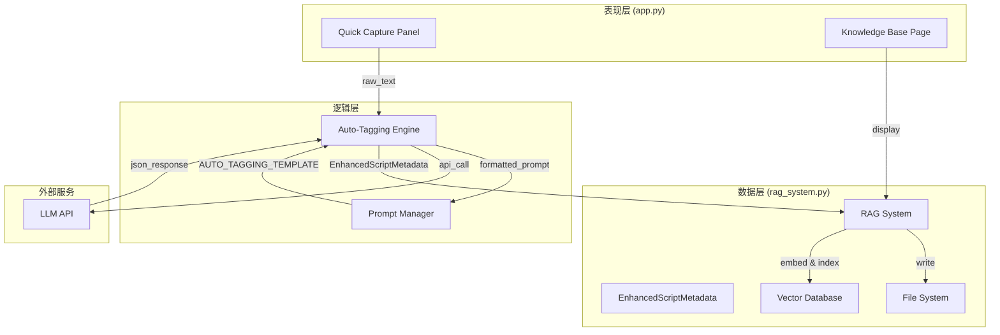
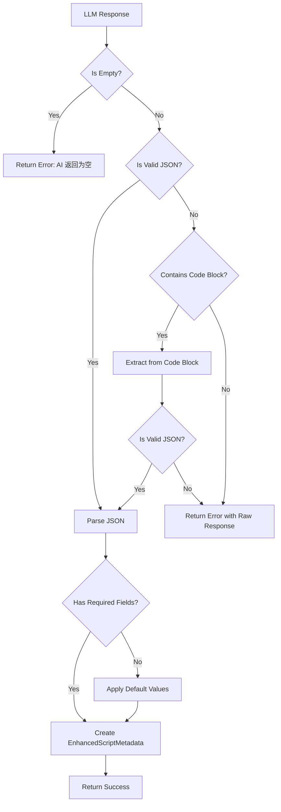
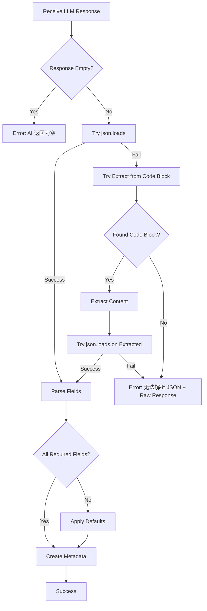

# Design Document: Smart Asset Management

## Overview

本设计文档描述知识库系统从"文件管理"向"智能资产管理"转型的技术实现方案。核心架构采用三层设计：数据层（EnhancedScriptMetadata）、逻辑层（Auto-Tagging Engine）、表现层（Quick Capture UI）。

系统通过 LLM 调用实现非结构化文案的自动标签提取，并根据识别的品类自动分发存储路径，同时写入文件系统和向量数据库。

## Architecture



## Components and Interfaces

### 1. EnhancedScriptMetadata (数据层)

**文件位置**: `src/rag_system.py`

```python
@dataclass
class EnhancedScriptMetadata:
    """增强型脚本元数据"""
    game_name: str = "未知"
    category: str = "其他"
    gameplay_tags: list = field(default_factory=list)
    hook_type: str = ""
    visual_style: str = ""
    summary: str = ""
    source: str = "user_capture"
    archived_at: str = field(default_factory=lambda: datetime.now().isoformat())
    
    # 向后兼容：从旧格式转换
    @classmethod
    def from_legacy(cls, legacy: ScriptMetadata) -> "EnhancedScriptMetadata":
        return cls(
            game_name=legacy.game_name,
            source=legacy.source,
            archived_at=legacy.archived_at
        )
```

### 2. AUTO_TAGGING_TEMPLATE (逻辑层)

**文件位置**: `src/prompts.py`

```python
AUTO_TAGGING_TEMPLATE = """你是一个资深的游戏广告数据分析师。
你的任务是将用户输入的非结构化广告文案，转化为结构化的元数据。

## 输入文案
{raw_content}

## 分析要求
请分析上述文案，提取以下关键信息，并严格以 JSON 格式输出：

1. **game_name**: 推测游戏名称（如无法推测，填"未知"）
2. **category**: 游戏核心品类（选填: SLG, MMO, 卡牌, 休闲, 二次元, 模拟经营, 射击, 其他）
3. **gameplay_tags**: 文案中涉及的具体玩法标签列表（如: "抽卡", "攻城", "合成", "捏脸"），不超过3个
4. **hook_type**: 脚本前3秒的吸睛手段（如: "福利诱惑", "巨大反差", "失败展示", "用户证言"）
5. **visual_style**: 脚本暗示的画面风格
6. **summary**: 一句话概括脚本核心剧情

## 输出示例 (JSON Only)
{{
    "game_name": "万国觉醒",
    "category": "SLG",
    "gameplay_tags": ["多文明混战", "行军策略"],
    "hook_type": "巨大反差",
    "visual_style": "美式卡通",
    "summary": "通过展示曹操打败凯撒的跨时空对决，体现多文明策略玩法。"
}}"""
```

### 3. RAGSystem.auto_ingest_script (逻辑层)

**文件位置**: `src/rag_system.py`

```python
def auto_ingest_script(
    self, 
    raw_text: str
) -> tuple[bool, str, Optional[EnhancedScriptMetadata]]:
    """
    智能入库：自动分析文案并入库
    
    Args:
        raw_text: 原始广告文案
        
    Returns:
        (success, message, metadata)
        - success: 是否成功
        - message: 结果消息或错误信息
        - metadata: 提取的元数据（成功时）
    """
```

### 4. Quick Capture Panel (表现层)

**文件位置**: `app.py`

```python
def render_quick_capture_panel():
    """渲染快速采集面板"""
    with st.expander("🚀 快速采集 (AI 智能打标)", expanded=True):
        raw_text = st.text_area(
            "粘贴广告文案",
            height=200,
            placeholder="在此粘贴广告脚本文案..."
        )
        
        if st.button("AI 分析并入库", type="primary"):
            # 调用 auto_ingest_script
            pass
```

## Data Models

### EnhancedScriptMetadata JSON Schema

```json
{
    "$schema": "http://json-schema.org/draft-07/schema#",
    "type": "object",
    "properties": {
        "game_name": {
            "type": "string",
            "default": "未知"
        },
        "category": {
            "type": "string",
            "enum": ["SLG", "MMO", "卡牌", "休闲", "二次元", "模拟经营", "射击", "其他"],
            "default": "其他"
        },
        "gameplay_tags": {
            "type": "array",
            "items": {"type": "string"},
            "maxItems": 3,
            "default": []
        },
        "hook_type": {
            "type": "string",
            "default": ""
        },
        "visual_style": {
            "type": "string",
            "default": ""
        },
        "summary": {
            "type": "string",
            "default": ""
        },
        "source": {
            "type": "string",
            "default": "user_capture"
        },
        "archived_at": {
            "type": "string",
            "format": "date-time"
        }
    },
    "required": ["game_name", "category"]
}
```

### LLM Response Parsing Flow



## Correctness Properties

*A property is a characteristic or behavior that should hold true across all valid executions of a system-essentially, a formal statement about what the system should do. Properties serve as the bridge between human-readable specifications and machine-verifiable correctness guarantees.*

### Property 1: EnhancedScriptMetadata Serialization Round-Trip

*For any* valid EnhancedScriptMetadata instance, serializing to JSON and then deserializing back should produce an equivalent object with all fields preserved, including the list-type gameplay_tags field.

**Validates: Requirements 1.4, 1.5**

### Property 2: Backward Compatibility from Legacy Format

*For any* valid ScriptMetadata (legacy format), converting to EnhancedScriptMetadata should preserve the original game_name, source, and archived_at values, while providing default values for new fields (category="其他", gameplay_tags=[], hook_type="", visual_style="", summary="").

**Validates: Requirements 1.2, 1.3**

### Property 3: Template Formatting Preserves Content

*For any* non-empty raw content string, formatting AUTO_TAGGING_TEMPLATE with that content should produce a prompt string that contains the original content verbatim.

**Validates: Requirements 2.2**

### Property 4: JSON Parsing with Default Values

*For any* valid JSON object (even with missing fields), parsing into EnhancedScriptMetadata should succeed and apply default values for any missing fields: game_name="未知", category="其他", gameplay_tags=[], hook_type="", visual_style="", summary="".

**Validates: Requirements 3.2, 6.4**

### Property 5: Fallback JSON Extraction from Code Blocks

*For any* string containing valid JSON wrapped in markdown code blocks (```json ... ``` or ``` ... ```), the fallback parser should successfully extract and parse the JSON content.

**Validates: Requirements 6.2**

### Property 6: Error Handling Returns Raw Response

*For any* string that cannot be parsed as JSON (even after fallback attempts), the error result should contain the original raw response string for debugging purposes.

**Validates: Requirements 6.3**

### Property 7: Category Determines Storage Path

*For any* valid category value from the allowed set (SLG, MMO, 卡牌, 休闲, 二次元, 模拟经营, 射击, 其他), the determined storage path should contain that category as a directory component.

**Validates: Requirements 3.4**

### Property 8: Successful Ingest Writes to File System

*For any* successful auto-ingest operation, a corresponding JSON file should exist in the file system at the path determined by the category, and the file should contain the script content and metadata.

**Validates: Requirements 3.5**

### Property 9: Successful Ingest Returns Metadata and ID

*For any* successful auto-ingest operation, the return value should contain a non-empty script ID and a valid EnhancedScriptMetadata object with all fields populated.

**Validates: Requirements 3.6**

## Error Handling

### LLM Response Error Handling Strategy



### Error Response Format

```python
@dataclass
class AutoIngestResult:
    success: bool
    message: str
    script_id: Optional[str] = None
    metadata: Optional[EnhancedScriptMetadata] = None
    raw_response: Optional[str] = None  # For debugging failed parses
```

### Fallback JSON Extraction

```python
def extract_json_from_response(response: str) -> Optional[dict]:
    """
    尝试从 LLM 响应中提取 JSON
    
    1. 直接尝试 json.loads
    2. 尝试从 ```json ... ``` 代码块提取
    3. 尝试从 ``` ... ``` 代码块提取
    4. 返回 None 表示失败
    """
    import re
    import json
    
    # 1. 直接尝试解析
    try:
        return json.loads(response)
    except json.JSONDecodeError:
        pass
    
    # 2. 尝试从 ```json 代码块提取
    json_block_pattern = r'```json\s*([\s\S]*?)\s*```'
    match = re.search(json_block_pattern, response)
    if match:
        try:
            return json.loads(match.group(1))
        except json.JSONDecodeError:
            pass
    
    # 3. 尝试从普通代码块提取
    code_block_pattern = r'```\s*([\s\S]*?)\s*```'
    match = re.search(code_block_pattern, response)
    if match:
        try:
            return json.loads(match.group(1))
        except json.JSONDecodeError:
            pass
    
    return None
```

## Testing Strategy

### Unit Tests

Unit tests will cover specific examples and edge cases:

1. **EnhancedScriptMetadata creation** - Test creating instances with various field combinations
2. **Legacy conversion** - Test converting ScriptMetadata to EnhancedScriptMetadata
3. **Template formatting** - Test AUTO_TAGGING_TEMPLATE with sample content
4. **JSON extraction edge cases** - Test with malformed JSON, nested code blocks, etc.
5. **Default value application** - Test parsing JSON with missing fields

### Property-Based Tests

Property-based tests will use `hypothesis` library to verify universal properties:

1. **Round-trip serialization** (Property 1) - Generate random EnhancedScriptMetadata, serialize/deserialize
2. **Backward compatibility** (Property 2) - Generate random ScriptMetadata, convert and verify
3. **Template content preservation** (Property 3) - Generate random strings, format and verify
4. **JSON parsing robustness** (Property 4) - Generate random JSON objects, parse and verify defaults
5. **Code block extraction** (Property 5) - Generate JSON wrapped in code blocks, extract and verify
6. **Error message content** (Property 6) - Generate unparseable strings, verify error contains original
7. **Path determination** (Property 7) - Generate valid categories, verify path contains category

### Test Configuration

- Property-based tests: minimum 100 iterations per property
- Test framework: pytest with hypothesis
- Tag format: **Feature: smart-asset-management, Property {number}: {property_text}**

