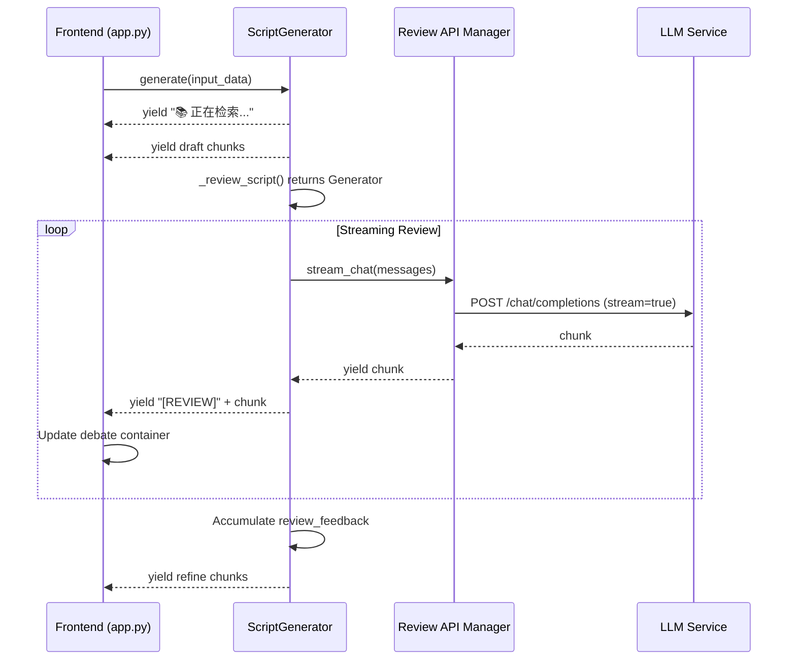

# Design Document: Streaming Review Debate

## Overview

本设计实现脚本生成流程中评审阶段的流式输出功能，将原本阻塞式的评审调用改造为流式输出，并在前端实现"辩论直播"界面。核心改动涉及两个文件：

1. `src/script_generator.py` - 后端流式评审支持
2. `app.py` - 前端辩论 UI 和 CSS 样式

## Architecture



## Components and Interfaces

### 1. ScriptGenerator._review_script (Modified)

**变更**: 从返回 `str` 改为返回 `Generator[str, None, None]`

```python
def _review_script(
    self, 
    input_data: GenerationInput, 
    script: str
) -> Generator[str, None, None]:
    """
    使用高级评审流程评审脚本 (流式版本)
    
    Args:
        input_data: 生成输入数据
        script: 待评审的脚本
        
    Yields:
        评审内容片段
    """
    # Step 1: 获取 RAG 高转化特征
    rag_traits = self._get_rag_traits(input_data.category)
    
    # Step 2: 构建评审 Prompt
    prompt = PromptManager.get_review_prompt(
        game_intro=input_data.game_intro,
        usp=input_data.usp,
        target_audience=input_data.target_audience,
        category=input_data.category,
        script=script,
        rag_traits=rag_traits,
        use_advanced=True
    )
    
    messages = [{"role": "user", "content": prompt}]
    
    # Step 3: 使用流式 API 调用
    for chunk in self.rev_api.stream_chat(messages):
        yield chunk
```

### 2. ScriptGenerator.generate (Modified Review Section)

**变更**: Step 3 评审部分改为迭代 Generator 并收集完整反馈

```python
# Step 3: 评审 (流式)
yield "🔍 正在评审脚本...\n\n"

review_feedback = ""
for chunk in self._review_script(input_data, draft_content):
    review_feedback += chunk
    yield f"[REVIEW]{chunk}"  # 带标记的评审内容

yield "\n\n"
```

### 3. Frontend Debate Container

**新增组件**: 在 `render_script_generation_page` 中处理评审阶段

```python
# 检测评审阶段并创建辩论容器
if "[REVIEW]" in chunk:
    if not debate_expander_created:
        debate_expander = st.expander(
            "⚔️ 评审委员会激烈辩论中 (思维链)...", 
            expanded=True
        )
        debate_container = debate_expander.empty()
        debate_content = ""
        debate_expander_created = True
    
    # 提取评审内容并更新
    review_text = chunk.replace("[REVIEW]", "")
    debate_content += review_text
    debate_container.markdown(debate_content)
```

### 4. CSS Styles for Debate Mode

**新增样式**: 在 `inject_custom_css` 中添加辩论模式样式

```css
/* 辩论模式样式 */
.debate-container h3 {
    background-color: #374151;
    padding: 10px 15px;
    border-radius: 8px;
    border-left: 4px solid #6366f1;
    margin-top: 20px;
    font-size: 16px;
    display: flex;
    align-items: center;
}
```

## Data Models

### Review Chunk Format

评审内容通过特殊前缀标记，便于前端识别和处理：

| 前缀 | 含义 | 处理方式 |
|------|------|----------|
| `[REVIEW]` | 评审内容片段 | 显示在辩论容器中 |
| 无前缀 | 其他生成内容 | 正常显示在主输出区 |

### GenerationStep Status Flow

```
rag_search: pending -> running -> completed
draft: pending -> running -> completed  
review: pending -> running -> completed  (流式输出期间保持 running)
refine: pending -> running -> completed
```

## Correctness Properties

*A property is a characteristic or behavior that should hold true across all valid executions of a system-essentially, a formal statement about what the system should do. Properties serve as the bridge between human-readable specifications and machine-verifiable correctness guarantees.*

### Property 1: Generator Return Type

*For any* call to `_review_script` with valid input, the method SHALL return a Generator object that yields string chunks when iterated.

**Validates: Requirements 1.1**

### Property 2: Content Accumulation Correctness

*For any* sequence of chunks `[c1, c2, ..., cn]` yielded by `_review_script`, the accumulated `review_feedback` SHALL equal `c1 + c2 + ... + cn` (string concatenation), and this complete feedback SHALL be passed to the refine step.

**Validates: Requirements 1.3, 2.2, 2.3**

### Property 3: Chunk Marker Consistency

*For any* chunk yielded by `generate()` during the review phase, it SHALL be prefixed with `[REVIEW]` marker, and *for any* chunk yielded during other phases (rag_search, draft, refine), it SHALL NOT contain the `[REVIEW]` marker.

**Validates: Requirements 2.4**

### Property 4: Frontend Content Accumulation

*For any* sequence of review chunks received by the frontend, the final displayed content in the debate container SHALL equal the concatenation of all received chunks (with `[REVIEW]` markers stripped).

**Validates: Requirements 4.1, 4.4**

### Property 5: CSS Debate Style Completeness

*For any* injected CSS, the debate container styles SHALL include all required properties: background-color (#374151), border-left (4px solid #6366f1), padding (10px 15px), border-radius (8px), font-size (16px), margin-top (20px), display (flex), and align-items (center).

**Validates: Requirements 5.1, 5.2, 5.3, 5.4, 5.5**

## Error Handling

### Streaming Error Recovery

```python
def _review_script(self, input_data, script) -> Generator[str, None, None]:
    try:
        for chunk in self.rev_api.stream_chat(messages):
            yield chunk
    except Exception as e:
        yield f"[错误] 评审过程中断: {str(e)}"
```

### Frontend Error Display

```python
if chunk.startswith("[错误]"):
    st.error(chunk)
else:
    debate_container.markdown(debate_content)
```

## Testing Strategy

### Testing Framework

- **Unit Tests**: pytest
- **Property-Based Tests**: hypothesis (Python PBT library)
- **Minimum iterations**: 100 per property test

### Unit Tests

1. **test_review_script_returns_generator**: 验证 `_review_script` 返回 Generator 类型
2. **test_stream_chat_called_not_chat**: 验证使用 `stream_chat()` 而非 `chat()`
3. **test_error_handling_yields_error_message**: 验证错误时 yield 错误消息
4. **test_refine_receives_complete_feedback**: 验证 refine 步骤收到完整反馈

### Property-Based Tests

1. **Property 1 Test (Generator Return Type)**: 
   - Generate random valid inputs
   - Verify `_review_script` returns Generator
   - **Feature: streaming-review-debate, Property 1: Generator Return Type**
   - **Validates: Requirements 1.1**

2. **Property 2 Test (Content Accumulation)**:
   - Generate random chunk sequences
   - Verify accumulated content equals concatenation
   - **Feature: streaming-review-debate, Property 2: Content Accumulation Correctness**
   - **Validates: Requirements 1.3, 2.2, 2.3**

3. **Property 3 Test (Chunk Marker Consistency)**:
   - Generate random generation outputs
   - Verify review chunks have `[REVIEW]` marker, others don't
   - **Feature: streaming-review-debate, Property 3: Chunk Marker Consistency**
   - **Validates: Requirements 2.4**

4. **Property 5 Test (CSS Completeness)**:
   - Verify CSS string contains all required properties
   - **Feature: streaming-review-debate, Property 5: CSS Debate Style Completeness**
   - **Validates: Requirements 5.1-5.5**

### Integration Tests

1. **test_full_generation_with_streaming_review**: 端到端测试完整生成流程
2. **test_debate_ui_state**: 测试辩论容器创建和状态保持

