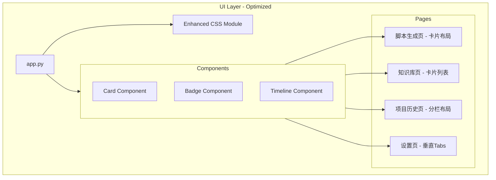

# Design Document

## Overview

本设计文档描述游戏广告脚本生成工具的 UI 布局优化方案。在现有深色科技感主题基础上，通过卡片组件、分栏布局、信息层级优化等手段，提升页面结构清晰度和用户操作效率。核心业务逻辑保持不变，仅修改 UI 渲染层代码。

## Architecture



## Components and Interfaces

### 1. Enhanced CSS Module

扩展现有 CSS 注入，添加卡片、徽章、时间线等组件样式。

```python
def inject_enhanced_css():
    """注入增强的 CSS 样式"""
    st.markdown("""
    <style>
    /* 现有样式保持不变 */
    
    /* 卡片组件样式 */
    .ui-card {
        background-color: #1f2937;
        border-radius: 12px;
        padding: 20px;
        border: 1px solid #374151;
        margin-bottom: 16px;
        min-width: 300px;
    }
    
    .ui-card-header {
        font-size: 16px;
        font-weight: 600;
        color: #f9fafb;
        margin-bottom: 12px;
        padding-bottom: 8px;
        border-bottom: 1px solid #374151;
    }
    
    /* 徽章样式 */
    .ui-badge {
        display: inline-block;
        padding: 4px 8px;
        border-radius: 4px;
        font-size: 12px;
        font-weight: 500;
    }
    
    .ui-badge-primary {
        background-color: #6366f1;
        color: #ffffff;
    }
    
    .ui-badge-secondary {
        background-color: #374151;
        color: #9ca3af;
    }
    
    .ui-badge-success {
        background-color: #10b981;
        color: #ffffff;
    }
    
    /* 时间线样式 */
    .ui-timeline {
        position: relative;
        padding-left: 24px;
    }
    
    .ui-timeline::before {
        content: '';
        position: absolute;
        left: 8px;
        top: 0;
        bottom: 0;
        width: 2px;
        background-color: #374151;
    }
    
    .ui-timeline-item {
        position: relative;
        padding-bottom: 16px;
    }
    
    .ui-timeline-item::before {
        content: '';
        position: absolute;
        left: -20px;
        top: 4px;
        width: 10px;
        height: 10px;
        border-radius: 50%;
        background-color: #6366f1;
    }
    
    /* 页面头部样式 */
    .page-header {
        display: flex;
        justify-content: space-between;
        align-items: center;
        padding: 12px 0;
        margin-bottom: 16px;
        border-bottom: 1px solid #374151;
    }
    
    .page-header-info {
        display: flex;
        gap: 16px;
        align-items: center;
    }
    
    /* 信息层级 - 标题字号 */
    .ui-h1 { font-size: 24px; font-weight: 700; color: #f9fafb; }
    .ui-h2 { font-size: 20px; font-weight: 600; color: #f9fafb; }
    .ui-h3 { font-size: 16px; font-weight: 500; color: #e5e7eb; }
    
    /* 次要文本 */
    .ui-text-secondary {
        color: #9ca3af;
        font-size: 14px;
    }
    
    /* 响应式布局 */
    @media (max-width: 1200px) {
        .responsive-cols {
            flex-direction: column;
        }
    }
    
    @media (max-width: 768px) {
        .ui-card {
            min-width: auto;
        }
    }
    
    /* 文本输入最小高度 */
    .stTextArea textarea {
        min-height: 80px;
    }
    </style>
    """, unsafe_allow_html=True)
```

### 2. Card Component Helper

Python 辅助函数，用于创建卡片容器。

```python
def render_card(title: str = None, content_func: callable = None):
    """
    渲染卡片组件
    
    Args:
        title: 卡片标题（可选）
        content_func: 渲染卡片内容的函数
    """
    card_html = '<div class="ui-card">'
    if title:
        card_html += f'<div class="ui-card-header">{title}</div>'
    st.markdown(card_html, unsafe_allow_html=True)
    
    if content_func:
        content_func()
    
    st.markdown('</div>', unsafe_allow_html=True)


def render_badge(text: str, variant: str = "primary"):
    """
    渲染徽章组件
    
    Args:
        text: 徽章文本
        variant: 样式变体 (primary, secondary, success)
    """
    return f'<span class="ui-badge ui-badge-{variant}">{text}</span>'
```

### 3. Script Generation Page - Optimized Layout

```python
def render_script_generation_page():
    """渲染脚本生成页面 - 优化布局"""
    
    # 页面头部
    render_page_header()
    
    # 输入区域 - 使用卡片分组
    st.markdown('<div class="ui-card">', unsafe_allow_html=True)
    st.markdown('<div class="ui-card-header">项目信息</div>', unsafe_allow_html=True)
    
    # 第一行：项目名称、客户名称、品类 (3列)
    col1, col2, col3 = st.columns([2, 2, 1])
    with col1:
        project_name = st.text_input("项目/游戏名称", ...)
    with col2:
        client_name = st.text_input("客户名称", ...)
    with col3:
        category = st.selectbox("游戏品类", ...)
    
    st.markdown('</div>', unsafe_allow_html=True)
    
    # 核心输入卡片
    st.markdown('<div class="ui-card">', unsafe_allow_html=True)
    st.markdown('<div class="ui-card-header">脚本参数</div>', unsafe_allow_html=True)
    
    # 使用 3:1 比例布局
    col1, col2 = st.columns([3, 1])
    with col1:
        game_intro = st.text_area("游戏介绍", height=150, ...)
    with col2:
        usp = st.text_area("独特卖点 (USP)", height=70, ...)
        target_audience = st.text_area("目标人群", height=70, ...)
    
    st.markdown('</div>', unsafe_allow_html=True)
    
    # 生成按钮 - 居中
    col1, col2, col3 = st.columns([1, 1, 1])
    with col2:
        generate_btn = st.button("生成脚本", use_container_width=True, type="primary")
    
    # 结果区域
    if st.session_state.generation_output:
        st.markdown("---")
        render_result_section()


def render_page_header():
    """渲染页面头部"""
    # 获取当前状态
    project = st.session_state.current_project
    api_manager = st.session_state.api_manager
    gen_config = api_manager.load_config() if api_manager else None
    rev_manager = st.session_state.get("review_api_manager")
    
    # 构建头部信息
    header_parts = []
    
    if project:
        header_parts.append(f"**项目:** {project.client_name} / {project.project_name}")
    else:
        header_parts.append("**项目:** 未选择")
    
    if gen_config:
        model_info = f"**生成:** {gen_config.model_id}"
        if rev_manager:
            rev_config = rev_manager.load_config()
            if rev_config:
                model_info += f" | **评审:** {rev_config.model_id}"
        header_parts.append(model_info)
    
    # 单行显示
    st.markdown(" · ".join(header_parts))


def render_result_section():
    """渲染结果区域"""
    output = st.session_state.generation_output
    
    st.markdown('<div class="ui-card">', unsafe_allow_html=True)
    st.markdown('<div class="ui-card-header">生成结果</div>', unsafe_allow_html=True)
    
    # 结果摘要
    if output.is_valid():
        storyboard_count = len(output.storyboard)
        st.markdown(f"已生成 **{storyboard_count}** 个分镜")
    
    # 可编辑表格
    # ... (保持现有 data_editor 逻辑)
    
    # 操作按钮 - 右对齐
    col1, col2, col3 = st.columns([2, 1, 1])
    with col2:
        st.button("导出", use_container_width=True)
    with col3:
        st.button("入库", use_container_width=True, type="primary")
    
    st.markdown('</div>', unsafe_allow_html=True)
```

### 4. Knowledge Base Page - Card List Layout

```python
def render_knowledge_base_page():
    """渲染知识库页面 - 卡片列表布局"""
    
    # 统计卡片区域
    col1, col2, col3 = st.columns([1, 1, 2])
    with col1:
        st.markdown('<div class="ui-card">', unsafe_allow_html=True)
        st.metric("脚本总数", total_scripts)
        st.markdown('</div>', unsafe_allow_html=True)
    with col2:
        st.markdown('<div class="ui-card">', unsafe_allow_html=True)
        st.metric("品类数量", len(categories))
        st.markdown('</div>', unsafe_allow_html=True)
    with col3:
        # 筛选栏
        selected_category = st.selectbox("筛选品类", ["全部"] + categories)
    
    st.markdown("---")
    
    # 脚本卡片列表
    for script in scripts:
        render_script_card(script)


def render_script_card(script):
    """渲染单个脚本卡片"""
    st.markdown('<div class="ui-card">', unsafe_allow_html=True)
    
    # 卡片头部 - 标题和徽章
    col1, col2 = st.columns([3, 1])
    with col1:
        game_name = script.metadata.game_name or "未命名"
        st.markdown(f"**{game_name}**")
    with col2:
        badge_html = render_badge(script.category, "primary")
        st.markdown(badge_html, unsafe_allow_html=True)
    
    # 元数据
    st.markdown(f'<span class="ui-text-secondary">入库时间: {script.metadata.archived_at}</span>', 
                unsafe_allow_html=True)
    
    # 展开/收起详情
    with st.expander("查看详情"):
        st.text(script.content[:500] + "..." if len(script.content) > 500 else script.content)
        if st.button("删除", key=f"delete_{script.id}"):
            # 删除逻辑
            pass
    
    st.markdown('</div>', unsafe_allow_html=True)
```

### 5. Project History Page - Split Layout

```python
def render_project_history_page():
    """渲染项目历史页面 - 左右分栏布局"""
    
    # 左右分栏
    left_col, right_col = st.columns([1, 2])
    
    with left_col:
        st.markdown("### 项目列表")
        render_project_tree()
    
    with right_col:
        if st.session_state.get("selected_history_project"):
            render_project_detail()
        else:
            st.info("请从左侧选择项目")


def render_project_tree():
    """渲染项目树形列表"""
    clients = project_manager.list_clients()
    
    for client in clients:
        with st.expander(client, expanded=False):
            projects = project_manager.get_projects_by_client(client)
            for project in projects:
                # 高亮当前选中项
                is_selected = (st.session_state.get("selected_history_project") == 
                              f"{client}/{project.project_name}")
                
                btn_type = "primary" if is_selected else "secondary"
                if st.button(project.project_name, key=f"proj_{client}_{project.project_name}",
                            type=btn_type, use_container_width=True):
                    st.session_state.selected_history_project = f"{client}/{project.project_name}"
                    st.rerun()


def render_project_detail():
    """渲染项目详情和历史脚本"""
    selected = st.session_state.selected_history_project
    client, project_name = selected.split("/")
    project = project_manager.get_project(client, project_name)
    
    # 项目信息卡片
    st.markdown('<div class="ui-card">', unsafe_allow_html=True)
    st.markdown(f"### {project.project_name}")
    
    col1, col2 = st.columns(2)
    with col1:
        st.markdown(f"**客户:** {project.client_name}")
        st.markdown(f"**品类:** {project.category or '未设置'}")
    with col2:
        st.markdown(f"**创建时间:** {project.created_at[:10]}")
        st.markdown(f"**脚本数:** {len(project.scripts_history) if project.scripts_history else 0}")
    
    st.markdown('</div>', unsafe_allow_html=True)
    
    # 历史脚本 - 时间线样式
    st.markdown("### 历史脚本")
    
    if project.scripts_history:
        st.markdown('<div class="ui-timeline">', unsafe_allow_html=True)
        for record in reversed(project.scripts_history):
            render_timeline_item(record)
        st.markdown('</div>', unsafe_allow_html=True)
    else:
        st.info("暂无历史脚本")


def render_timeline_item(record):
    """渲染时间线项"""
    st.markdown('<div class="ui-timeline-item">', unsafe_allow_html=True)
    
    # 时间和状态
    status_badge = render_badge("已入库", "success") if record.is_archived else render_badge("未入库", "secondary")
    st.markdown(f"**版本 {record.version}** · {record.created_at[:10]} {status_badge}", 
                unsafe_allow_html=True)
    
    # 内容预览
    with st.expander("查看内容"):
        st.text(record.content[:300] + "..." if len(record.content) > 300 else record.content)
    
    st.markdown('</div>', unsafe_allow_html=True)
```

### 6. Settings Page - Vertical Tabs Layout

```python
def render_settings_page():
    """渲染设置页面 - 垂直 Tabs 布局"""
    
    st.markdown("## 设置")
    
    # 使用左右分栏模拟垂直 tabs
    left_col, right_col = st.columns([1, 3])
    
    with left_col:
        st.markdown('<div class="ui-card">', unsafe_allow_html=True)
        
        # 设置菜单
        settings_options = ["API 配置", "提示词管理", "关于"]
        selected_setting = st.radio(
            "设置项",
            settings_options,
            label_visibility="collapsed"
        )
        
        st.markdown('</div>', unsafe_allow_html=True)
    
    with right_col:
        if selected_setting == "API 配置":
            render_api_settings_card()
        elif selected_setting == "提示词管理":
            render_prompt_settings_card()
        elif selected_setting == "关于":
            render_about_card()


def render_api_settings_card():
    """渲染 API 配置卡片"""
    st.markdown('<div class="ui-card">', unsafe_allow_html=True)
    st.markdown('<div class="ui-card-header">API 配置</div>', unsafe_allow_html=True)
    
    # 配置列表表格
    all_configs = api_manager.get_all_configs()
    if all_configs:
        config_data = []
        for config in all_configs:
            config_data.append({
                "名称": config.name,
                "模型": config.model_id,
                "状态": "当前" if config.name == active_config_name else ""
            })
        
        st.dataframe(config_data, use_container_width=True, hide_index=True)
    
    st.markdown("---")
    
    # 新增/编辑表单
    st.markdown("#### 添加/编辑配置")
    # ... (配置表单)
    
    st.markdown('</div>', unsafe_allow_html=True)
```

## Data Models

### UI State Extensions

```python
# Session state 扩展
st.session_state.selected_history_project: str  # 项目历史页选中的项目
st.session_state.selected_setting: str  # 设置页选中的设置项
```

## Correctness Properties

*A property is a characteristic or behavior that should hold true across all valid executions of a system-essentially, a formal statement about what the system should do. Properties serve as the bridge between human-readable specifications and machine-verifiable correctness guarantees.*

由于本次重构主要涉及 UI 布局和视觉设计，大部分需求属于视觉设计范畴，无法通过自动化属性测试验证。以下是可测试的属性：

### Property 1: 结果摘要显示正确的分镜数量

*For any* 有效的 ScriptOutput 对象，结果摘要中显示的分镜数量应等于 output.storyboard 列表的长度。

**Validates: Requirements 3.2**

### Property 2: 脚本卡片包含必要信息

*For any* 脚本对象，渲染的脚本卡片应包含品类标签、游戏名称（或"未命名"）、入库时间三项信息。

**Validates: Requirements 4.4**

## Error Handling

### UI 渲染错误处理

| 错误类型 | 处理方式 |
|---------|---------|
| HTML 注入失败 | 静默失败，使用默认 Streamlit 样式 |
| 项目数据加载失败 | 显示错误提示，提供重试选项 |
| 脚本列表为空 | 显示友好的空状态提示 |

### 布局降级策略

| 场景 | 降级方案 |
|-----|---------|
| CSS 不支持 | 回退到 Streamlit 默认样式 |
| 分栏布局失败 | 使用单列布局 |
| 自定义组件失败 | 使用 Streamlit 原生组件 |

## Testing Strategy

### 单元测试

由于本次重构主要涉及 UI 布局，大部分测试为手动验证。以下为可自动化的测试：

```python
import pytest

def test_result_summary_storyboard_count():
    """Feature: ui-layout-optimization, Property 1: 结果摘要显示正确的分镜数量"""
    from src.script_generator import ScriptOutput
    
    # 测试不同长度的 storyboard
    test_cases = [
        (["分镜1"], 1),
        (["分镜1", "分镜2", "分镜3"], 3),
        ([], 0),
        (["分镜" + str(i) for i in range(10)], 10),
    ]
    
    for storyboard, expected_count in test_cases:
        output = ScriptOutput(
            storyboard=storyboard,
            voiceover=["口播"] * len(storyboard),
            design_intent=["意图"] * len(storyboard),
            raw_content="test"
        )
        assert len(output.storyboard) == expected_count


def test_script_card_contains_required_info():
    """Feature: ui-layout-optimization, Property 2: 脚本卡片包含必要信息"""
    # 测试脚本元数据完整性
    from src.rag_system import ScriptMetadata
    
    metadata = ScriptMetadata(
        game_name="测试游戏",
        source="test",
        archived_at="2024-01-01"
    )
    
    # 验证必要字段存在
    assert metadata.game_name is not None
    assert metadata.archived_at is not None


def test_css_contains_min_width():
    """验证 CSS 包含卡片最小宽度"""
    # 读取 app.py 中的 CSS
    with open("app.py", "r", encoding="utf-8") as f:
        content = f.read()
    
    assert "min-width" in content


def test_css_contains_min_height():
    """验证 CSS 包含文本输入最小高度"""
    with open("app.py", "r", encoding="utf-8") as f:
        content = f.read()
    
    assert "min-height" in content


def test_css_contains_heading_sizes():
    """验证 CSS 包含标题字号定义"""
    with open("app.py", "r", encoding="utf-8") as f:
        content = f.read()
    
    # 检查是否定义了不同的字号
    assert "24px" in content or "font-size" in content


def test_css_contains_badge_styles():
    """验证 CSS 包含徽章样式"""
    with open("app.py", "r", encoding="utf-8") as f:
        content = f.read()
    
    assert "badge" in content.lower() or "ui-badge" in content
```

### 手动测试清单

由于 UI 布局重构涉及视觉效果，以下需要手动验证：

1. [ ] 脚本生成页卡片布局正确显示
2. [ ] 页面头部状态信息紧凑展示
3. [ ] 输入区域 3:1 列比例正确
4. [ ] 知识库页统计卡片显示
5. [ ] 知识库脚本卡片列表样式
6. [ ] 项目历史页左右分栏布局
7. [ ] 项目树形列表展开/收起
8. [ ] 历史脚本时间线样式
9. [ ] 设置页垂直 tabs 布局
10. [ ] API 配置列表表格显示
11. [ ] 响应式布局在窄屏下正常
12. [ ] 徽章样式正确显示
13. [ ] 信息层级字号区分明显

## Dependencies

无新增依赖，使用现有技术栈：
- Streamlit
- streamlit-option-menu
- pandas
