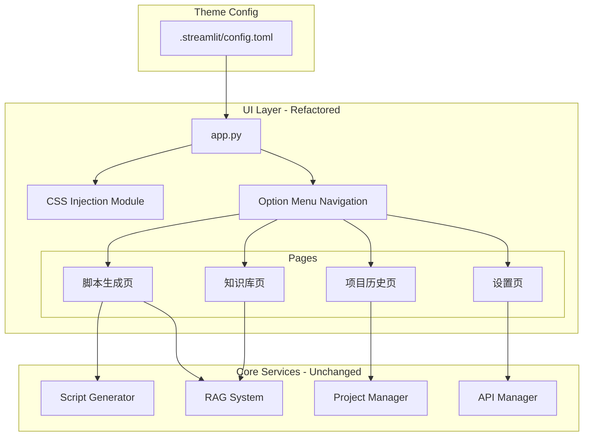

# Design Document

## Overview

本设计文档描述游戏广告脚本生成工具的 UI/UX 重构方案。重构采用 Streamlit + streamlit-option-menu 技术栈，通过 CSS 注入实现深色科技感主题，使用导航菜单替代堆叠式侧边栏，优化输入布局和结果展示方式。核心业务逻辑（RAGSystem、ScriptGenerator 等）保持不变，仅修改 UI 渲染层代码。

## Architecture



## Components and Interfaces

### 1. Theme Configuration (`.streamlit/config.toml`)

深色科技感主题配置。

```toml
[theme]
base = "dark"
primaryColor = "#6366f1"
backgroundColor = "#111827"
secondaryBackgroundColor = "#1f2937"
textColor = "#f9fafb"

[server]
headless = true
```

### 2. CSS Injection Module

在 `app.py` 开头注入自定义 CSS 样式。

```python
def inject_custom_css():
    """注入自定义 CSS 样式"""
    st.markdown("""
    <style>
    /* 隐藏 Streamlit 默认元素 */
    #MainMenu {visibility: hidden;}
    footer {visibility: hidden;}
    header {visibility: hidden;}
    
    /* 主应用背景 */
    .stApp {
        background-color: #111827;
    }
    
    /* 输入组件圆角 */
    .stSelectbox > div > div,
    .stTextInput > div > div > input,
    .stTextArea > div > div > textarea {
        border-radius: 8px;
    }
    
    /* 卡片容器样式 */
    .st-card {
        background-color: #1f2937;
        border-radius: 12px;
        padding: 20px;
        border: 1px solid #374151;
        margin-bottom: 16px;
    }
    
    /* 按钮样式优化 */
    .stButton > button {
        border-radius: 8px;
        font-weight: 500;
    }
    
    /* 主按钮样式 */
    .stButton > button[kind="primary"] {
        background-color: #6366f1;
        border: none;
    }
    
    .stButton > button[kind="primary"]:hover {
        background-color: #4f46e5;
    }
    </style>
    """, unsafe_allow_html=True)
```

### 3. Navigation Component

使用 streamlit-option-menu 实现侧边栏导航。

```python
from streamlit_option_menu import option_menu

def render_navigation() -> str:
    """
    渲染侧边栏导航菜单
    
    Returns:
        str: 选中的菜单项名称
    """
    with st.sidebar:
        selected = option_menu(
            menu_title="CreativElixir",
            options=["脚本生成", "知识库", "项目历史", "设置"],
            icons=["pen-tool", "database", "clock-history", "gear"],
            menu_icon="robot",
            default_index=0,
            styles={
                "container": {
                    "padding": "0!important",
                    "background-color": "transparent"
                },
                "icon": {
                    "color": "#818cf8",
                    "font-size": "18px"
                },
                "nav-link": {
                    "font-size": "15px",
                    "text-align": "left",
                    "margin": "5px",
                    "--hover-color": "#374151"
                },
                "nav-link-selected": {
                    "background-color": "#6366f1"
                }
            }
        )
    return selected
```

### 4. Page Rendering Functions

每个页面对应一个渲染函数。

```python
def render_script_generation_page():
    """渲染脚本生成页面"""
    pass

def render_knowledge_base_page():
    """渲染知识库页面"""
    pass

def render_project_history_page():
    """渲染项目历史页面"""
    pass

def render_settings_page():
    """渲染设置页面 - 整合 API 配置和提示词管理"""
    pass
```

### 5. Script Generation Page - Input Layout

紧凑的多列输入布局。

```python
def render_generation_inputs():
    """渲染脚本生成输入区域"""
    # 第一行：项目信息
    col1, col2, col3 = st.columns([2, 1, 1])
    with col1:
        project_name = st.text_input("项目名称")
    with col2:
        category = st.selectbox("游戏品类", categories)
    with col3:
        # 预留或其他快捷选项
        pass
    
    # 第二行：核心输入
    col1, col2 = st.columns(2)
    with col1:
        game_intro = st.text_area("游戏介绍", height=120)
        usp = st.text_area("独特卖点 (USP)", height=80)
    with col2:
        target_audience = st.text_area("目标人群", height=80)
        # 其他选项
```

### 6. Generation Process Display

使用 st.status 包裹生成过程。

```python
def run_generation_with_status(input_data: GenerationInput):
    """
    执行脚本生成并在 status 容器中显示过程
    """
    with st.status("正在构建创意...", expanded=True) as status:
        # RAG 检索阶段
        status.write("正在检索同品类参考脚本...")
        # ... RAG 检索逻辑
        
        # 初稿生成阶段
        status.write("正在生成脚本初稿...")
        # ... 生成逻辑
        
        # 评审阶段
        status.write("正在评审脚本质量...")
        # ... 评审逻辑
        
        # 修正阶段
        status.write("正在优化脚本...")
        # ... 修正逻辑
        
        # 完成
        status.update(label="创意构建完成!", state="complete", expanded=False)
    
    return result
```

### 7. Result Display with Data Editor

使用 st.data_editor 展示可编辑结果。

```python
def render_script_result(output: ScriptOutput):
    """
    渲染脚本生成结果
    
    Args:
        output: 脚本输出对象
    """
    import pandas as pd
    
    # 构建 DataFrame
    max_len = max(
        len(output.storyboard),
        len(output.voiceover),
        len(output.design_intent)
    )
    
    df = pd.DataFrame({
        "分镜": output.storyboard + [""] * (max_len - len(output.storyboard)),
        "口播": output.voiceover + [""] * (max_len - len(output.voiceover)),
        "设计意图": output.design_intent + [""] * (max_len - len(output.design_intent))
    })
    
    # 可编辑表格
    edited_df = st.data_editor(
        df,
        use_container_width=True,
        num_rows="dynamic",
        column_config={
            "分镜": st.column_config.TextColumn("分镜", width="medium"),
            "口播": st.column_config.TextColumn("口播", width="large"),
            "设计意图": st.column_config.TextColumn("设计意图", width="medium")
        }
    )
    
    # 入库按钮 - 右对齐
    col1, col2, col3 = st.columns([3, 1, 1])
    with col3:
        if st.button("入库", use_container_width=False):
            # 入库逻辑
            pass
    
    return edited_df
```

### 8. Settings Page Structure

整合 API 配置和提示词管理。

```python
def render_settings_page():
    """渲染设置页面"""
    st.markdown("## 设置")
    
    # 使用 tabs 组织设置项
    tab1, tab2 = st.tabs(["API 配置", "提示词管理"])
    
    with tab1:
        render_api_settings_content()
    
    with tab2:
        render_prompt_management_content()
```

## Data Models

### Navigation State

```python
# Session state 中的导航状态
st.session_state.current_page: str  # 当前选中的页面
```

### Edited Script Data

```python
# 用户编辑后的脚本数据
@dataclass
class EditedScript:
    storyboard: list[str]
    voiceover: list[str]
    design_intent: list[str]
    is_modified: bool  # 是否被用户修改过
```

## Correctness Properties

*A property is a characteristic or behavior that should hold true across all valid executions of a system-essentially, a formal statement about what the system should do. Properties serve as the bridge between human-readable specifications and machine-verifiable correctness guarantees.*

### Property 1: 主题配置正确性

*For any* 有效的 `.streamlit/config.toml` 文件，解析后应包含以下精确值：primaryColor 为 "#6366f1"，backgroundColor 为 "#111827"，secondaryBackgroundColor 为 "#1f2937"，textColor 为 "#f9fafb"。

**Validates: Requirements 1.1, 1.2, 1.3, 1.4**

### Property 2: Emoji 清理完整性

*For any* `app.py` 源代码文件，所有 `st.button`、`st.markdown`（用于标题）、`st.info`、`st.warning`、`st.error`、`st.success` 调用中的字符串参数不应包含 Emoji 字符（Unicode 范围 U+1F300-U+1F9FF）。

**Validates: Requirements 3.1, 3.2, 3.3**

### Property 3: 导航菜单配置正确性

*For any* `option_menu` 调用，其 `options` 参数应包含 ["脚本生成", "知识库", "项目历史", "设置"]，`icons` 参数应包含 ["pen-tool", "database", "clock-history", "gear"]，`menu_title` 应为 "CreativElixir"，且 `styles` 中 `nav-link-selected` 的 `background-color` 应为 "#6366f1"。

**Validates: Requirements 4.2, 4.3, 4.4, 4.6**

### Property 4: CSS 样式定义正确性

*For any* 注入的 CSS 样式字符串，应包含：`#MainMenu {visibility: hidden;}`、`footer {visibility: hidden;}`、`border-radius: 12px`（卡片容器）、`border-radius: 8px`（输入组件）、`#374151`（边框颜色）。

**Validates: Requirements 2.1, 2.2, 2.3, 2.4**

### Property 5: 状态容器配置正确性

*For any* 脚本生成流程中的 `st.status` 调用，初始 `expanded` 参数应为 `True`，完成时 `status.update` 调用的 `expanded` 参数应为 `False`，`state` 应为 `"complete"`。

**Validates: Requirements 6.2, 6.3, 6.4**

### Property 6: 结果展示配置正确性

*For any* 脚本结果展示中的 `st.data_editor` 调用，DataFrame 应包含 "分镜"、"口播"、"设计意图" 三列，且"入库"按钮的 `use_container_width` 参数应为 `False`。

**Validates: Requirements 7.2, 7.5**

## Error Handling

### UI 渲染错误处理

| 错误类型 | 处理方式 |
|---------|---------|
| streamlit-option-menu 未安装 | 显示安装提示，回退到基础 st.selectbox 导航 |
| CSS 注入失败 | 静默失败，使用默认 Streamlit 样式 |
| DataFrame 构建失败 | 显示原始文本内容，提示用户手动处理 |

### 页面导航错误处理

| 错误类型 | 处理方式 |
|---------|---------|
| 未知页面选择 | 默认显示脚本生成页 |
| Session state 丢失 | 重新初始化默认状态 |

## Testing Strategy

### 单元测试

使用 pytest 进行单元测试，覆盖以下内容：

- `test_theme_config.py`: 验证 config.toml 主题配置值
- `test_css_injection.py`: 验证 CSS 样式字符串内容
- `test_navigation_config.py`: 验证导航菜单配置参数

### 属性测试

由于本次重构主要涉及 UI 配置和静态值验证，大部分测试为示例测试而非属性测试。以下使用 pytest 进行验证：

```python
import pytest
import toml

def test_theme_config_correctness():
    """Feature: ui-saas-refactor, Property 1: 主题配置正确性"""
    config = toml.load(".streamlit/config.toml")
    theme = config.get("theme", {})
    
    assert theme.get("primaryColor") == "#6366f1"
    assert theme.get("backgroundColor") == "#111827"
    assert theme.get("secondaryBackgroundColor") == "#1f2937"
    assert theme.get("textColor") == "#f9fafb"

def test_emoji_removal():
    """Feature: ui-saas-refactor, Property 2: Emoji 清理完整性"""
    import re
    
    with open("app.py", "r", encoding="utf-8") as f:
        content = f.read()
    
    # Emoji Unicode 范围
    emoji_pattern = re.compile(
        "["
        "\U0001F300-\U0001F9FF"  # 常见 Emoji
        "\U00002702-\U000027B0"  # Dingbats
        "\U0001F600-\U0001F64F"  # Emoticons
        "]"
    )
    
    # 检查 st.button, st.markdown 等调用中的字符串
    # 简化检查：整个文件不应包含 Emoji
    matches = emoji_pattern.findall(content)
    assert len(matches) == 0, f"Found Emoji characters: {matches}"
```

### 手动测试清单

由于 UI 重构涉及视觉效果，以下需要手动验证：

1. [ ] 深色主题正确应用
2. [ ] 汉堡菜单和 Footer 已隐藏
3. [ ] 侧边栏导航菜单正常工作
4. [ ] 输入区域布局紧凑
5. [ ] 生成过程在 status 容器中显示
6. [ ] 结果表格可编辑
7. [ ] 入库按钮位置正确

## Dependencies

### 新增依赖

```
streamlit-option-menu>=0.3.6
```

### 安装命令

```bash
pip install streamlit-option-menu
```

